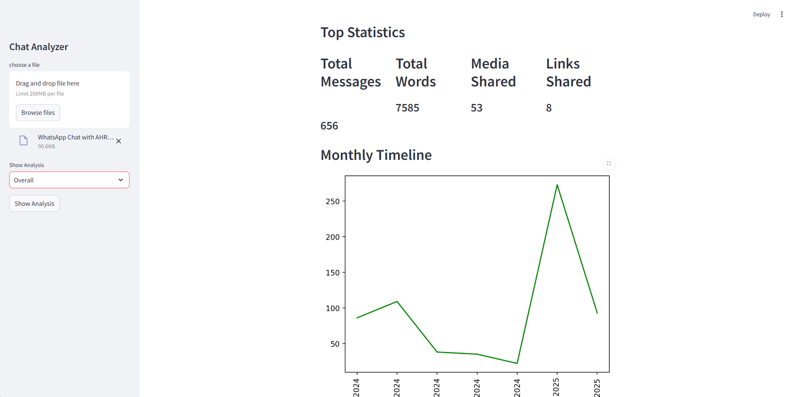

### WhatsApp Chat Analyzer
#### 1. Project Objective
To develop a Python tool capable of parsing, cleaning, and analyzing unstructured WhatsApp chat export files. The project showcases skills in text data processing, regular expressions, and data visualization to extract meaningful insights from conversational data.

#### 2. Methodology
* **Data Parsing:** Used Regular Expressions (Regex) to parse the raw text file, correctly identifying and separating message timestamps, users, and message content.

* **Feature Engineering:** Created new features from the raw data, such as message date, time, user, and the message itself, organizing them into a structured Pandas DataFrame.

* **Data Analysis:** Performed analyses to identify the most active users, message frequency over time, and common words used in the chat.

#### 3. Impact
This project demonstrates the ability to handle and extract value from unstructured text data, a core skill in Natural Language Processing (NLP) and customer feedback analysis. The tool successfully transforms a messy text file into a structured dataset ready for quantitative analysis.

