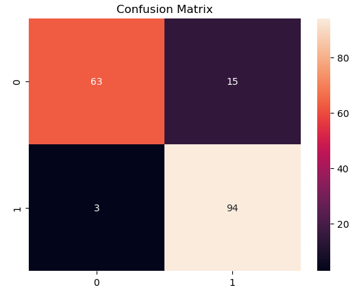

### Heart Disease Prediction: A Comparative Analysis of Classification Models
### 1. Project Objective
The goal of this project is to build and evaluate a range of machine learning models to predict the presence of heart disease in patients based on 13 medical attributes. The notebook performs an end-to-end analysis, from data exploration and preprocessing to training and comparing four different classification algorithms to identify the most effective one.

### 2. Dataset
The analysis uses the publicly available Heart Disease UCI dataset. It consists of 1190 patient records and 12 columns, including the 'target' variable, where a value of 1 indicates the presence of heart disease and 0 indicates its absence.

### 3. Methodology
#### a. Data Exploration and Preprocessing (EDA) 
* **Initial Analysis:** The dataset was loaded and inspected using df.info(), df.describe(), and df.isnull().sum() to understand its structure and confirm there were no missing values.

* **Target Variable Distribution:** The balance of the target variable was checked using df.target.value_counts() and visualized with a seaborn.countplot to ensure a reasonable distribution between classes.

* **Correlation Analysis:** A correlation matrix was generated and visualized as a seaborn.heatmap to understand the relationships between different medical attributes and their correlation with the presence of heart disease.

* **Data Splitting & Scaling:** The dataset was split into an 80% training set and a 20% test set. All features were then scaled using StandardScaler to normalize their ranges and ensure optimal model performance.

#### b. Model Implementation and Evaluation
Four distinct classification models were trained on the preprocessed data and evaluated based on their accuracy score on the unseen test data.

The models implemented are:

* **Logistic Regression:** A reliable linear model that serves as a strong baseline.

* **Decision Tree Classifier:** A non-linear model that creates a tree-based structure for decision-making.

* **Random Forest Classifier:** An ensemble model composed of multiple decision trees to improve robustness and reduce overfitting.

* **Gradient Boosting Classifier:** A powerful ensemble technique that builds models sequentially, with each new model correcting the errors of the previous ones.

### 4. Results and Conclusion
The performance of each model was calculated and compared. The Gradient Boosting Classifier achieved the highest accuracy on the test set.

| Model                        | Accuracy Score |
| :--------------------------- | :------------- |
| **Gradient Boosting Classifier** | **89.71%** |
| **Logistic Regression** | 85.14%         |
| **Decision Tree Classifier** | 82.28%         |
| **Random Forest Classifier** | 85.71%         |



### 5. How to Run This Project
1. **Clone the repository:**
```bash
git clone [https://github.com/Malaya-Kumar-Pradhan/Machine-Learning-Projects.git](https://github.com/Malaya-Kumar-Pradhan/Machine-Learning-Projects.git)
cd Machine-Learning-Projects/Heart-Disease-Prediction
```
2. **Install dependencies:**
```bash
pip install pandas numpy matplotlib seaborn scikit-learn
```
3. **Run the Jupyter Notebook:**
```bash
jupyter notebook "Heart_disease_prediction.ipynb"
```
